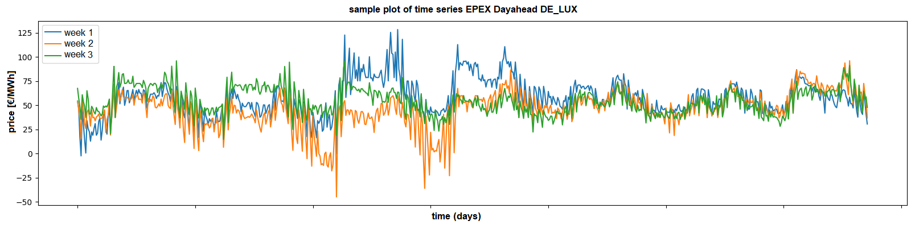
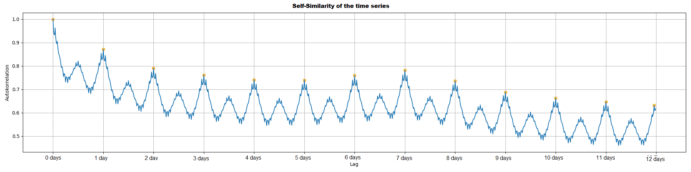

# Paper Data Repository - Influence of Forecast Improvement (Germany)

# Contex

For the sake of transparency and reproducibility, this paper includes the data basis for the work presented in the following paper:

```
placeholder
```

BibTeX citation

```
placeholder
```

# Data description

## Format

All input dataset follow the following format and structure

```csv
time (UTC),time series name [unit],(potential further columns with same strucutre)Lag-1d (mod),Forecast: Benchmark Lag-1d,Forecast: Benchmark Lag-7d
2021-01-07 23:00:00 UTC+0000,50.53,51.03,51.03,50.87
2021-01-08 00:00:00 UTC+0000,48.43,50.18,50.18,48.19
2021-01-08 01:00:00 UTC+0000,47.24,48.97,48.97,44.68
```

- The time column is in UTC (format is `YYYY-MM-DDTHH:MM:SSZ` in ISO 8601)

- files are csv-files (comma-separated)


## Repository structure

### 01 Input


preprocessed Input data for:

- energy market data (EPEX DA, EPEX ID, EXAA)

- control reserve market data (SRL+, SRL-, MRL+, MRL-)

- market features (expected demand, expected generation)


### 02 Explorations


Exploration files for the profiles from the input folder. High-level exploration includes:

- ACF-curves

- plot of all daily load profiles combined

- distribution of the loads 
  
  - weekly aggregated
  - hourly aggregated
  - as a histogram

- cluster-analysis (Profile clusters and calendar plots)

- plots of some sample days and weeks

Plaese note that some images are labeled in German language only.


### 03 Forecasts

- Forecast format files for three lag-benchmarks.  

- Same structure as explained above
